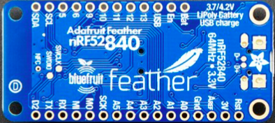
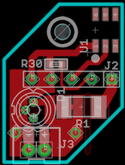

### Introduction

Version 0.78 of xSpectre handheld spectrometer is built around a customised Printed Circuit Board (PCB). The breakout boards used in versions 0.3 to 0.6 are replaced with a single PCB.

<figure class="half">

<figcaption> Customised PCB (58x88 mm) for version 0.78 of xSpectre's handheld spectreotmer; left: drawing, right: 3D design including battery and shell.</figcaption>
</figure>

{: .pull-right}
The central microprocessor in version 0.78 is an [Adafruit Feather nRF52840](../../module/module-feather-nRF52840). The microprocessor comes built-in with e.g. Bluetooth Low Energy (BLE) and functions and connections for a LiPo battery. For a complete list of feature and setup instructions see the post on [Adafruit Feather nRF52840](../../module/module-feather-nRF52840). Other changes in the hardware design of version 0.78 include:

- stabilized and software-controlled energy supply of different types of light sources,
- attachment of different light sources and sample holders with bayonet mount,
- 5 pin connection to light sources to enable information exchange and automated power adjustments,
- 8-pin GX16 aviator plug for general purpose external sensors and probes, and
- built-in BNC connector for Ion Selective Electrodes.

### Container box and lock

Container box v0.78 for a single customised PCB and bayonet mounted light muzzles (interactive 3D graphics).

<iframe width="640" height="480" style="border:1px solid #eeeeee;" src="https://3dviewer.net/embed.html#model=https://raw.githubusercontent.com/karttur/common/master/3dmodels/spectro-box-C14384MA-gx16special_20220902_v078b.stl$camera=-36.34210,119.88926,108.20663,-0.00001,10.40000,0.00000,0.00000,1.00000,0.00000$envsettings=fishermans_bastion,off$backgroundcolor=255,255,255,255$defaultcolor=200,200,200$edgesettings=off,0,0,0,1"></iframe>

Container lock v0.78 with holes for the different built-in light sources of the Adafruit Feather nRF52840 and cut-out for the BNC expansion port.

<iframe width="640" height="480" style="border:1px solid #eeeeee;" src="https://3dviewer.net/embed.html#model=https://raw.githubusercontent.com/karttur/common/master/3dmodels/spectro-lock_20220905_v078b.stl$camera=-59.43708,86.74943,118.87415,-0.00001,7.50000,0.00000,0.00000,1.00000,0.00000$envsettings=fishermans_bastion,off$backgroundcolor=255,255,255,255$defaultcolor=200,200,200$edgesettings=off,0,0,0,1"></iframe>

### Spectral sensors

The PCB of v 0.78 is prepared for using 3 different spectral [miniature Hamamatsu sensors](https://www.hamamatsu.com/eu/en/product/photometry-systems/mini-spectrometer/selection-guide.html):

- [C12666MA, @ 340 - 780 nm](https://www.hamamatsu.com/eu/en/product/optical-sensors/spectrometers/mini-spectrometer/C12666MA.html),
- [C12880MA @ 340 - 850 nm](https://www.hamamatsu.com/all/en/product/optical-sensors/spectrometers/mini-spectrometer/C12880MA.html), and
- [C14384MA-01 @ 600 - 1050 nm](https://www.hamamatsu.com/all/en/product/optical-sensors/spectrometers/mini-spectrometer/C14384MA-01.html).

The wiring for the three sensors are similar and the PCB has prepared ports for mounting all 3. C12666MA and C12880MA are built using identical containers while the smaller C14384MA-01 is different. The latter requires a silicon padding fitted inside a connection socket with connection pins corresponding to the C12666MA/C12880MA container.

<figure class="third">

<figcaption> The Hamamatsu C12666MA/C12880MA spectral sensor container, 14 pin (2*7) DIP IC connection socket and the Hamamatsu C14384MA-01 spectral sensor.</figcaption>
</figure>

### External ports

Version 0.78 is equipped with two external expansion connections: a BNC (coaxial) connector mainly for Ion Selective Electrodes (ISEs), and a GX16 (aviation) plug for general sensors. The BNC connector is soldered directly on the customised PCB and its use is straight forward. The GX16 aviation plug is connected to the PCB with 8 pins, and the wiring of each device linked via the GX16 plug need to be designed regarding the power needs and communication protocol as outlined in the post [J3 GX connections v0.78](../spectrolum-v078-J3-GX-connections).

### Light sources/sample holders

The light muzzles for v0.78 was redesigned to be built with a new customised Printed Circuit Board (PCB) - to be positioned horizontally rather than vertically in the light muzzle. To fit the horizontal PCB the light nozzle was redesigned.

Light muzzle with the corresponding bayonet mount and the platform for fastening a "horizontal" PCB.

<iframe width="640" height="480" style="border:1px solid #eeeeee;" src="https://3dviewer.net/embed.html#model=https://raw.githubusercontent.com/karttur/common/master/3dmodels/spectro-direct-cyl-led_20220904_v078b.stl$camera=24.93195,67.71786,68.96772,0.00000,13.00000,0.22500,0.00000,1.00000,0.00000$envsettings=fishermans_bastion,off$backgroundcolor=255,255,255,255$defaultcolor=200,200,200$edgesettings=off,0,0,0,1"></iframe>

### Light source PCB

{: .pull-right}
Version 0.78 comes with a customised light-PCB (20x30 mm) for the light holder muzzle. The light-PCB fulfils 4 objectives:

- connecting different light sources to the spectrometer,
- holding the light source in place,
- holding the female right angle 5-pin POGO in place, and
- hosting a 1-wire memory chip defining the light source.

### pogo 5-pin connection

{: .pull-right}
The connection between the spectrometer and the light muzzle is accomplished with a female and a male 5-pin POGO connector, both with right angle solder pins.

### Bayonet and pogo pin connections

<figure class="half">

<figcaption> v0.78 bayonet mount with POGO connections, male on the main PCB and female on the light PCB; left image shows the POGO pins connected (without the container box); right image shows the separate POGO connectors positioned in the container box and the light muzzle.</figcaption>
</figure>
