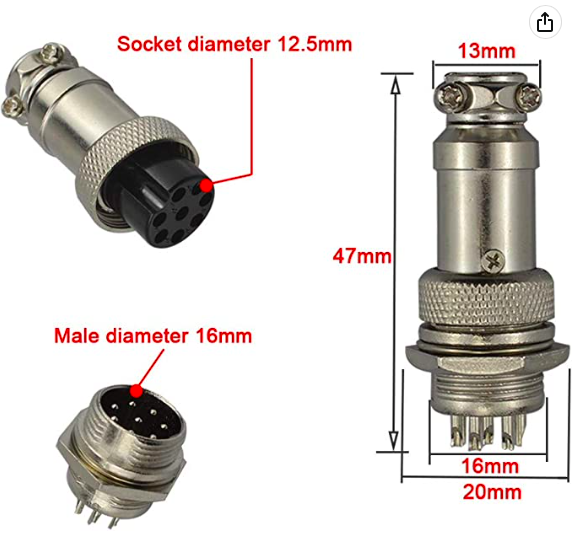

### Introduction

Version 0.06 (relabelled to 0.6) and later of the xSpectrolum spectrometer are all equipped with an aviator plug for connecting a variety of different external probes (sensors). Versions 0.60 to 0.77 had a GX12 (12 mm) plug with a maximum of 6 pins. Starting with version 0.78, built on a customised Printed Circuit Board (PCB), the spectrometers are instead equipped with a GX16 (16 mm) plug with up to a maximum of 10 pins.

The present generation of xSpectrolum<b>+</b> (0.80) uses an 8-pin GX16 plug.

<figure>

<figcaption> 8-pin GX16 aviation plug used in xSpectrolum v0.79 and later for connecting external probes.</figcaption>
</figure>

### GX16 plug

GX16 (aviation) plugs are available from a range of resellers on both [Amazon](https://www.amazon.se) and [AliExpress](https://www.aliexpress.com). I have ordered the 8-pin GX16 plugs from [this reseller on Amazon.se](https://www.amazon.se/dp/B07VNKZB65?psc=1&ref=ppx_yo2ov_dt_b_product_details).
