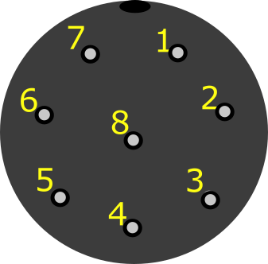

### Introduction

Version 0.78 of xSpectre handheld spectrometer is equipped with two external expansion connections: a BNC (coaxial) connector mainly for Ion Selective Electrodes, and a GX16 (aviation) plug for general sensors. This post outlines the wiring of the GX16 connector, and how to solder both the male GX16 plug that is part of the spectrometer and the female plugs that is soldered to the cable of each sensor that can be attached.

### GX16 expansion ports

Previous versions of xSpectre's spectrometer used GX12 (12 for 12 mm diameter) plugs. GX12, however, can only have up to 7 pins and version 0.78 of the spectrometer requires 8 pins. Hence version 0.78 is built for using GX16 plugs that are available for up to 10 pins. The pin numbering of the GX 8-pin version is shown in the figure below.

<figure class="half">

<figcaption> The numbering of the GX16 8-pin plug in xSpectre v078; upper row shows the male side that is permanently mounted to the spectrometer box, the lower row the female side that is attached to the cord of each sensor; the left column shows the outer side that are joined, the right column the inner side that are soldered.</figcaption>
</figure>

{: .pull-right}
The spectrometer internal, Printed Circuit Borad (PCB), connects to the permanently mounted GX16 female port using an 8-pin JST connector ([BM08B-SRSS-TBT(LF)(SN)/Conn Header SMD 8pos 1mm](https://www.digikey.se/sv/products/detail/jst-sales-america-inc/BM08B-SRSS-TBT-LF-SN/1640130?s=N4IgTCBcDaICwFYEFowE4FuQRmQOQBEQBdAXyA)). This connector is directly mounted on the spectrometer PCB.

{: .pull-right}
The 8-pin JST and the male "backside" of the GX16 aviation plug are connected using 8 thread JST jumper connector ([A08SR08SR30K51A/Jumper 08SR-3S - 08SR-3S 2-inch](https://www.digikey.se/sv/products/detail/jst-sales-america-inc/A08SR08SR30K51A/6009376)). The 8 pins are connected to the PCB with the following functions:

| pin | function |
| 1 | +5 V |
| 2 | + 3.3 V |
| 3 | Analoge signal |
| 4 |  MODBUS B |
| 5 | MODBUS A  |
| 6 | I2C SDA  |
| 7 | I2C SCL |
| 8 | GND  |

The figure below illustrates the connection ports of the 8 threaded JST jumper connector.

<figure>

<figcaption>8 thread JST jumper connector used for connecting GX (aviation plug) to PCB of xSpectre spectrometer version 0.78.</figcaption>
</figure>

### Single analog signal sensor - capacitive soil moisture

The [capacitive soil moisture probe](../../project/project-capacitive-sm-v1-2/) connects to the microprocessor using 3 ports:

| pin | function | thread color |
| 2 | + 3.3 V | red |
| 3 | Analoge signal | yellow ]
| 8  | GND  | black |

The soldering on the backside of the female sensor cord side GX16 plug looks like in the figure below.

<figure>

<figcaption>Capacitive soil moisture GX16 backside female (sensor cord side) solder connection.</figcaption>
</figure>

### I2C sensor - AMS mini spectrometer

The [AMS mini spectrometer module from Adafruit](../../module/module-AS726X-spectrometer) connects to the microprocessor using the I2C protocol and these 5 ports:

| pin | function |
| 2 | + 3.3 V |
| 3 | Analoge signal |
| 6  | I2C SDA  |
| 7  | I2C SCL |
| 8  | GND  |

<figure>

<figcaption>AMS Adafruit breakout board GX16 backside female (sensor cord side) solder connection.</figcaption>
</figure>

### MODBUS sensor - AMS mini spectrometer

[MODBUS-RTU](https://en.wikipedia.org/wiki/Modbus) is an industrial standard communication protocol that is often physically connected using the [RS485](https://en.wikipedia.org/wiki/RS-485) port protocol. This combination of MODBUS-RTU + RS485 is implemented in xSpectre v0.78 via the GX16 expansion plug. This setup is used for connecting the [SEEED-studio](https://www.seeedstudio.com/RS485-Soil-Moisture-Temperature-Sensor-S-Soil-MT-02-p-4634.html) industrial-grade soil moisture, electrical conductivity and temperature sensor [S-Soil MT-02A](../../sensor/sensor-seeed-modbus-soil-moisture). The GX16 pin wiring for RS485 in xSpectre's version 0.78:

| pin | function |
| 1 | +5 V |
| 4 | MODBUS B |
| 5 | MODBUS A |
| 8 | GND  |

<figure>

<figcaption>MODBUS protocol GX16 backside female (sensor cord side) solder connection.</figcaption>
</figure>
