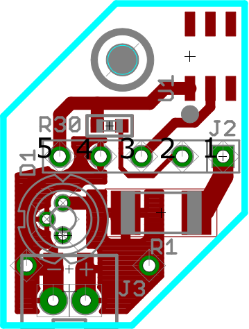
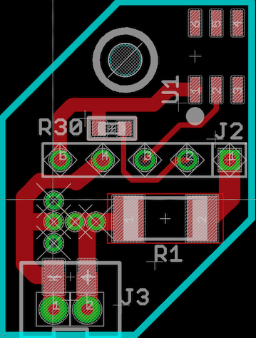

### Introduction

This post is a manual for setting up a python interface to xSpectre´s spectrometer v0.78. This post was inspired by the article [Using Python and an Arduino to Read a Sensor](https://pythonforundergradengineers.com/python-arduino-potentiometer.html) by Peter Kazarinoff.

### Prerequisit

The post assumes that you have installed <span class='app'>Arduino IDE</span> and [<span class='app'>Anaconda</span>](https://karttur.github.io/setup-ide/setup-ide/install-anaconda/). The latter for creating a virtual python environment. You must of course also have access to xSpectre's spectrometer version 0.78.

### Virtual python environment

Start by creating a [virtual python environment]().

<span class='terminal'>conda create -y -n arduino python=3.8 --no-default-packages</span>

Active the _arduino_ enviroment:

<span class='terminal'>conda activate arduino</span>

Install the following packages; <span class='package'>pyserial</span>, <span class='package'>numpy</span> and <span class='package'>matplotlib</span>:

<span class='terminal'>conda install pyserial</span>

<span class='terminal'>conda install numpy</span>

<span class='terminal'>conda install matplotlib</span>

### Connecting AMS 6 channel spectrometer breakout boards

To get started, let us make an Arduino code and a python script for reading the spectral signal for [AMS 6-band spectrometer](https://karttur.github.io/arduino/module/module-AS726X-spectrometer/). This can be mounted as an external sensor using xSpectre's [spectrometer GX connection](../../spectrolum/spectrolum-v078-J3-GX-connections).

#### Arduino code

The Arduino code for the AMS 6-channel breakout board turns on and off the built in light source of the breakout board and loops reading temperature and the 6 bands, and sends the results as a comma separated value (csv) string with 8 values; the first value indicating if this is a sample (1) or a dark (0) signal, the second the temperature followed by the 6 bands.

```


### Light PCB

The 5-pogo pins (see figure below) have the following functions on the light PCB:

| pin | function |
| 1 | Vin led (variable) |
| 2 | FB Extern resistor Vset |
| 3 | Vin 1-wire (+3.3 V) |
| 4  |  GND led |
| 5  | GND 1-wire |

<figure class="half">


<figcaption> PCB for bayonet light muzzle ("xspecled") for xSpectre's spectrometer version 0.78.</figcaption>
</figure>

#### 1-wire setup

1-wire memory units have 6 ports but only require 2 to operate. The 1-wire unit space on the xpsecled PCB is the upper right corner (see figure above), whit only 2 of the 6 (surface mounted) ports connected. As seen in the table above, the 1-wire unit connects to the pogo pins 3 and 5.

At the other end, the 1-wire connects to I/O port 19 of the microcontroller. The sketch below reads the id of the 1-wire connected via the bayonet mounted POGO pins.

```
/*
DS250x add-only programmable memory reader w/SKIP ROM.

 The DS250x is a 512/1024bit add-only PROM(you can add data but cannot change the old one) that's used mainly for device identification purposes
 like serial number, mfgr data, unique identifiers, etc. It uses the Maxim 1-wire bus.

 This sketch will use the SKIP ROM function that skips the 1-Wire search phase since we only have one device connected in the bus on digital pin 6.
 If more than one device is connected to the bus, it will fail.
 Sketch will not verify if device connected is from the DS250x family since the skip rom function effectively skips the family-id byte readout.
 thus it is possible to run this sketch with any Maxim OneWire device in which case the command CRC will most likely fail.
 Sketch will only read the first page of memory(32bits) starting from the lower address(0000h), if more than 1 device is present, then use the sketch with search functions.
 Remember to put a 4.7K pullup resistor between pin 6 and +Vcc

 To change the range or ammount of data to read, simply change the data array size, LSB/MSB addresses and for loop iterations

 This example code is in the public domain and is provided AS-IS.

 Built with Arduino 0022 and PJRC OneWire 2.0 library http://www.pjrc.com/teensy/td_libs_OneWire.html

 created by Guillermo Lovato <glovato@gmail.com>
 march/2011

 */

#define USERSWITCH    7
#define nKILL         17
#define nPBINT        18


#include "OneWire.h"
OneWire ds(19);                    // OneWire bus on digital pin 19

#if defined(USE_TINYUSB)
#include <Adafruit_TinyUSB.h> // for Serial
#endif

void setup() {
  pinMode(nKILL,    OUTPUT); // #KILL
  pinMode(nPBINT,   INPUT);  // #PBINT (pushbutton)

  pinMode(USERSWITCH,   INPUT);  // User switch

  digitalWrite(nKILL, HIGH);     // Keep the unit on. 3v3 feeds Rh/T sensor, Ph sensor and LED driver DAC


  Serial.begin(115200);
  while ( !Serial ) {
    digitalWrite(LED_RED, HIGH);
    delay(100);   // for nrf52840 with native usb
    digitalWrite(LED_RED, LOW);
    delay(100);
  }
}

void loop() {
  byte i;                         // This is for the for loops
  boolean present;                // device present var
  byte data[32];                  // container for the data from device
  byte leemem[3] = {              // array with the commands to initiate a read, DS250x devices expect 3 bytes to start a read: command,LSB&MSB adresses
    0xF0 , 0x00 , 0x00   };       // 0xF0 is the Read Data command, followed by 00h 00h as starting address(the beginning, 0000h)
  byte ccrc;                      // Variable to store the command CRC
  byte ccrc_calc;

  present = ds.reset();           // OneWire bus reset, always needed to start operation on the bus, returns a 1/TRUE if there's a device present.
  ds.skip();                      // Skip ROM search

  if (present == true) {          // We only try to read the data if there's a device present
    Serial.println("DS250x device present");
    ds.write(leemem[0],1);        // Read data command, leave ghost power on
    ds.write(leemem[1],1);        // LSB starting address, leave ghost power on
    ds.write(leemem[2],1);        // MSB starting address, leave ghost power on

    ccrc = ds.read();             // DS250x generates a CRC for the command we sent, we assign a read slot and store it's value
    ccrc_calc = OneWire::crc8(leemem, 3);  // We calculate the CRC of the commands we sent using the library function and store it

    if ( ccrc_calc != ccrc) {      // Then we compare it to the value the ds250x calculated, if it fails, we print debug messages and abort
      Serial.println("Invalid command CRC!");
      Serial.print("Calculated CRC:");
      Serial.println(ccrc_calc,HEX);    // HEX makes it easier to observe and compare
      Serial.print("DS250x readback CRC:");
      Serial.println(ccrc,HEX);
      return;                      // Since CRC failed, we abort the rest of the loop and start over
    }
    Serial.println("Data is: ");   // For the printout of the data
    for ( i = 0; i < 32; i++) {    // Now it's time to read the PROM data itself, each page is 32 bytes so we need 32 read commands
      data[i] = ds.read();         // we store each read byte to a different position in the data array
      Serial.print(data[i]);       // printout in ASCII
      Serial.print(" ");           // blank space
    }
    Serial.println();
    delay(5000);                    // Delay so we don't saturate the serial output
  }
  else {                           // Nothing is connected in the bus
    Serial.println("Nothing connected");
    delay(3000);
  }
}
```

#### Light source setup

The power supply to the light source is via pogo pin 1 (see figure above). The power is only distributed to a single soldering block. To connect V+ to the mounting area for different light sources a surface mounted resistor need to be put at position R1.

### Resources

https://create.arduino.cc/projecthub/ansh2919/serial-communication-between-python-and-arduino-e7cce0

https://stackabuse.com/getting-user-input-in-python/

https://pythonforundergradengineers.com/python-arduino-potentiometer.html

https://stackoverflow.com/questions/6039367/python-arduino-with-mac-os-x
