### Introduction

This post contains the 3D print parts for the xspectrolum<b>+</b> v093a. The parts are made to fit the Printed Circuit Board (PCB) xspectrolum v2rB (version 2, revision B).

<b>If you have the credentials for accessing the xSpectre GitHub repo you can look at interactive 3D views and download the stl files. Simply click the images and GitHub will automatically render an interactive 3D view of the same part. Download the corresponding stl file by clicking the download button _Download raw file_ in the GitHub window.

### Printer settings for support material

Some of the 3D parts have negative surfaces that require support material - primarily the front parts of the main container shells. The support material fill up some narrow and elongated spaces (i.e. the female bayonet of the main container shells) and need to be set to only attach loosely. The settings I have found working are summarised in table 1.

_Table 1: recommended printer setting for support material_

| parameter | value |
| :--------------- | :--------------- |
| Overhang threshold | 45 |
| Raft layers | 0 |
| Style | Grid |
| Top contact Z distance | 0.25 |
| Bottom contact Z distance | Same as top |
| Pattern | Rectlinear |
| Pattern spacing | 3 |
| Closing radius | 2 |
| Top interface layers | 4 |
| Bottom interface layers | 0 |
| Interface pattern | Rectlinear |
| Interface pattern spacing | 0.2 |
| XY separation ... | 75% |

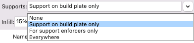{: .pull-right}
You only need to add support material for parts that have negative surfaces directly above the print plate - thus you should select the option _Support on build plate only_ for these parts. For the smallest part you can also add a brim, but a well calibrated 3D printer with a prepared bed can print all parts without brim.

### Main container shell

The main container box of the xSpectrolum v093a can hold 5 differently shaped spectral sensors modules, of which 2 fit in the same design (either singularly or together). For several of the shapes there are multiple sensor models, each covering a different spectral range, available. v093a can thus hold 10 different spectral sensors using 4 different container shells.

Further, for each sensor type the container can be produced with or without ports for external sensors. The container can also be produced for only external sensors and no bayonet join for a main spectral sensor.

#### Front shell for Hamamatsu C16767MA/C12666MA/C12880MA

<figure>
<a href="https://github.com/xspectrolum/v093a/blob/main/stl/xspectrolum_box_front-C12880MA-GX-BNC_v093a_20240512.stl">
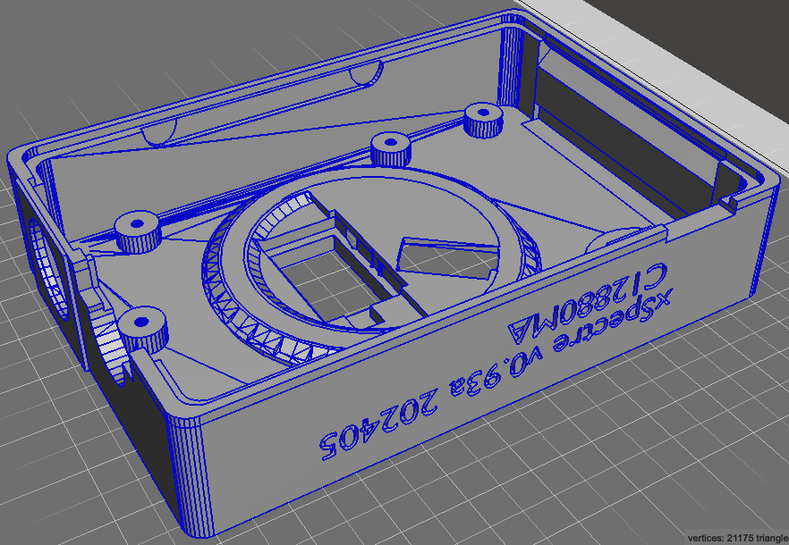
</a>
<figcaption> 3D model of the xSpectrolum front shell for Hamamatsu C16767MA/C12666MA/C12880MA spectral sensors, with external ports.</figcaption>
</figure>

#### Front shell for Hamamatsu C14483MA

<figure>
<a href="https://github.com/xspectrolum/v093a/blob/main/stl/xspectrolum_box_front-C14384MA-GX-BNC_v093a_20240512.stl">
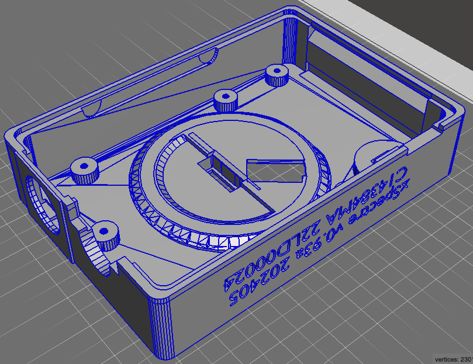
</a>
<figcaption> 3D model of the xSpectrolum front shell for the Hamamatsu C14384MA spectral sensor, with external ports.</figcaption>
</figure>

#### Front shell for AMS AS7341/AS7343 and AS7421

<figure>
<a href="https://github.com/xspectrolum/v093a/blob/main/stl/xspectrolum_box_front-AMS-GX-BNC_v093a_20240512.stl">
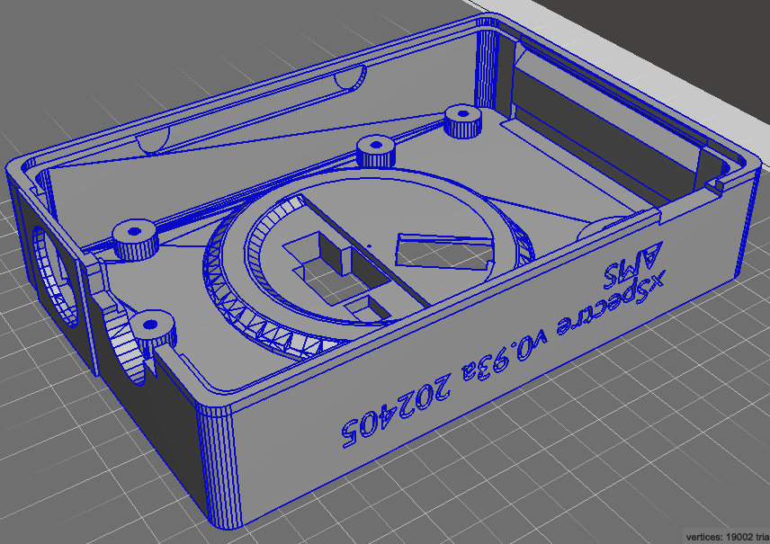
</a>
<figcaption> 3D model of the xSpectrolum front shell for either AS7341/AS7343 and AS7421 (this version can carry two parallel sensors) AMS spectral sensors.</figcaption>
</figure>

#### Back shell for containers with external ports

<figure>
<a href="https://github.com/xspectrolum/v093a/blob/main/stl/xspectrolum_box_back-GX-BNC_v093a_20240512.stl">
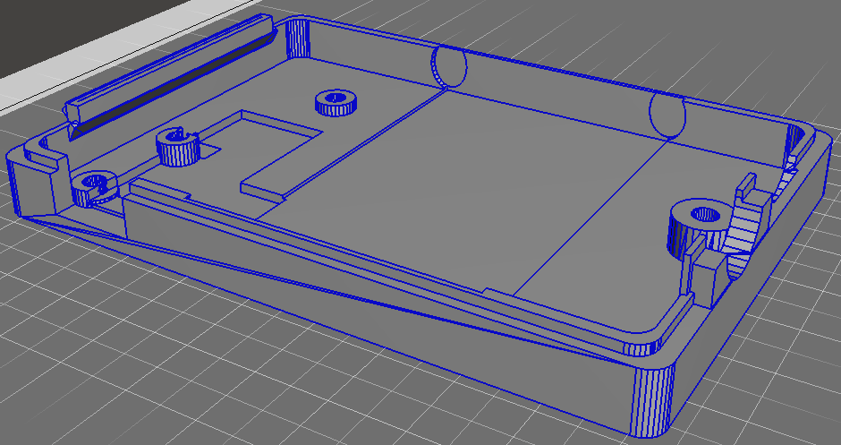
</a>
<figcaption> 3D model of the xSpectrolum back shell for containers with external ports.</figcaption>
</figure>

### Main container bayonet cover

The bayonet cover is for protecting the spectral sensor and the interior of the main container. It comes in two versions, one higher for the Hamamatsu C16767MA/C12666MA/C12880MA spectral sensors and one lower for all other sensor.

#### Bayonet cover for Hamamatsu C16767MA/C12666MA/C12880MA

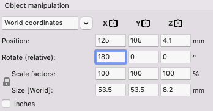{: .pull-right}
Note, when printing this part it should be rotated 180 degrees in the X or Y dimension (as illustrated to the right), flipping the top to becoming the bottom to print against the print bed.

<figure>
<a href="https://github.com/xspectrolum/v093a/blob/main/stl/xspectrolum_lock_box-bayonet-high_v093a_20240512.stl">
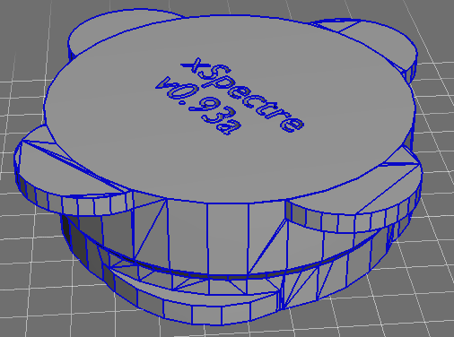
</a>
<figcaption> 3D model of the xSpectrolum bayonet cover for Hamamatsu C16767MA/C12666MA/C12880MA containers.</figcaption>
</figure>

#### Bayonet cover for all other sensors

{: .pull-right}
Note, when printing this part it should be rotated 180 degrees in the X or Y dimension (as illustrated to the right), flipping the top to becoming the bottom to print against the print bed.

<figure>
<a href="https://github.com/xspectrolum/v093a/blob/main/stl/xspectrolum_lock_box-bayonet-low_v093a_20240512.stl">
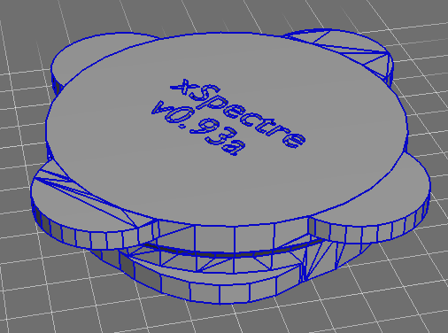
</a>
<figcaption> 3D model of the xSpectrolum bayonet cover for non-extruding spectral sensing components.</figcaption>
</figure>

#### Battery holder

The battery holder encloses the LiPo battery and fixates it in the back shell of the main container. There are corresponding cut-outs in the front covers that allows the battery holder to slide into the front shell when assembling the main container.

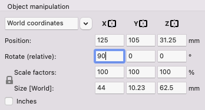{: .pull-right}
Note, when printing this part it should be rotated 90 degrees in the x-dimension (as illustrated to the right), flipping the side with the text to becoming the bottom to print against the print bed.  

<figure>
<a href="https://github.com/xspectrolum/v093a/blob/main/stl/xspectrolum_batteri-box_v093a_20240512.stl">
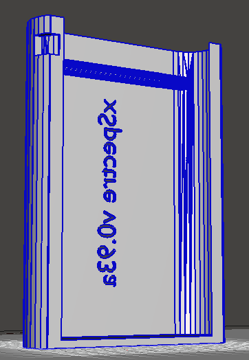
</a>
<figcaption> 3D model of the xSpectrolum battery holder.</figcaption>
</figure>

### Solid sampling equipment

The equipment for solid sampling consists of a muzzle, that is basically a cylinder with a male bayonet joint that also has a platform for attaching the xSpecled PCB. The other (front) end of the muzzle has a simpler (female) bayonet joint. The front end bayonet joint is for attaching a protective lock. The protective lock comes in 2 different versions, both with a second function; either for sample holding or including a white reference. There is also a separate cover for protecting the white reference when not attached to the muzzle.

It is easier to use a sample dish that has no second function (as you do not need to rotate the dedicated sample dish to fit the the openings for the bayonet hooks). Thus there is also a simple sample dish part.

#### Muzzle for solid sampling

<figure>
<a href="https://github.com/xspectrolum/v093a/blob/main/stl/xspectrolum_muzzle_solid-n-m-noveil_v093a_20240512.stl">
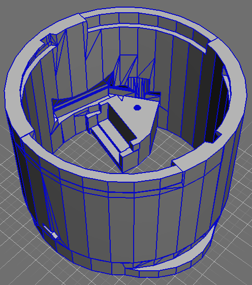
</a>
<figcaption> 3D model of the xSpectrolum muzzle for solid sampling.</figcaption>
</figure>

#### Solid sampling dish

<figure>
<a href="https://github.com/xspectrolum/v093a/blob/main/stl/xspectrolum_sample_solid-n_v093a_20241205.stl">
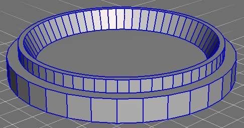
</a>
<figcaption> 3D model of the xSpectrolum (grained) solid sampling dish.</figcaption>
</figure>

#### Solid sampling dish and muzzle cover combined

<figure>
<a href="https://github.com/xspectrolum/v093a/blob/main/stl/xspectrolum_lock+sample_solid-n_v093a_20240526.stl">
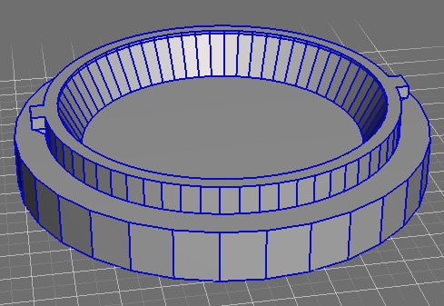
</a>
<figcaption> 3D model of the xSpectrolum (grained) solid sampling dish and muzzle lock that fits the solid sampling muzzle.</figcaption>
</figure>

#### Solid sampling white reference and muzzle cover combined

<figure>
<a href="https://github.com/xspectrolum/v093a/blob/main/stl/xspectrolum_lock-whiteref_solid-n_v093a_20240526.stl">
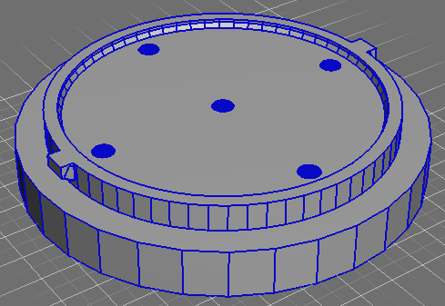
</a>
<figcaption> 3D model of the xSpectrolum solid sampling white reference that also function as a muzzle cover lock. The five holes are expanding inwards and are the anchors of the white reference mixture that is poured into the depression.</figcaption>
</figure>

#### Solid sampling white reference cover

{: .pull-right}
Note, when printing this part it should be rotated 180 degrees in the X or Y dimension (as illustrated to the right), flipping the top to becoming the bottom to print against the print bed.

<figure>
<a href="https://github.com/xspectrolum/v093a/blob/main/stl/xspectrolum_lock_muzzle-bayonet_v093a_20240526.stl">
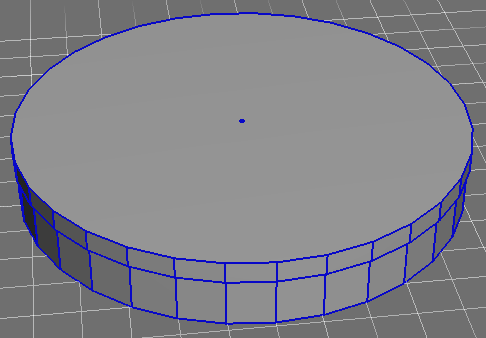
</a>

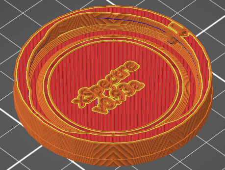

<figcaption> 3D model of the xSpectrolum solid sampling white reference cover; top: original 3D print model, bottom: print code after rotating 180 degrees in the x-dimension.</figcaption>
</figure>

### Liquid (cuvette) sampling equipment

The equipment for liquid sampling consists of a muzzle, that is a cylinder with a bayonet joint that usually also has a platform for attaching the xSpecled PCB. The cylinder has a cubicle cut-out that fits any of a number of cuvette holders. Cuvette holders include those that shines through the liquid sample (absorbance/transmittance spectroscopy) or monochromatic (laser or LED) light that shines at right angle compared to the spectral sensor (fluorescence or Raman spectroscopy). The absorbance/transmittance version comes both with broad band led lights and single band led lights - the latter are also useful for checking the calibration settings of the sepctral sensors.

There are also versions, of both the muzzle and the cuvette holder, for attaching a (stronger) external laser. Finally, two different covers are also available - one for muzzles with absorbance/transmittance lamps (higher) and one for muzzles with fluorescence/Raman lamps (lower).

#### Muzzle for liquid (cuvette) sampling

The muzzle for liquid samples joins the cuvette holder to the main container using the bayonet joint. It comes in 2 version: a standard version for all lamps that connect via the pogo-pins in the bayonet joins, and one special version for external lasers that lack the pogo-pin connectors.

<figure>
<a href="https://github.com/xspectrolum/v093a/blob/main/stl/xspectrolum_muzzle_cuvette_v093a_20240512.stl">
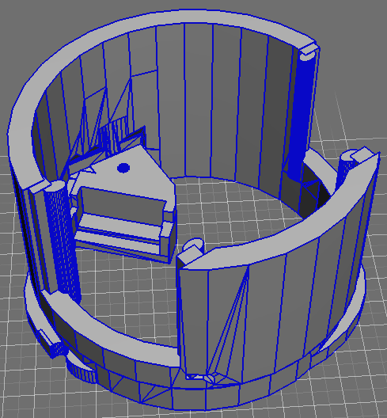
</a>
<figcaption> 3D model of the xSpectrolum muzzle for liquid (cuvette) sampling.</figcaption>
</figure>

<figure>
<a href="https://github.com/xspectrolum/v093a/blob/main/stl/xspectrolum-muzzle-cuvette-external-laser_20230317_v080g.stl">
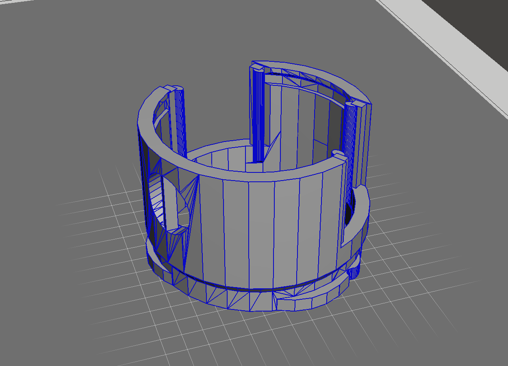
</a>
<figcaption> 3D model of the xSpectrolum muzzle for liquid (cuvette) sampling using an external laser.</figcaption>
</figure>

#### Cuvette holder for absorbance/transmittance

In cuvette holders for absorbance/transmittance, the lamp is positioned opposite the spectral sensor and the light pass through the (usually 10 mm) liquid to analyse. The light can either be broad band or narrow band. The latter can also be used for checking the wavelength calibration of the spectral sensor.

At time of writing this (June 2024) only LED lights are used for the cuvette holders. The preferred form-factor is to use 5mm LEDs, but for some wave-lengths, 5mm LEDs are not available or were out of stock when ordering.

Because the position of the light entry hole/slit varies between the spectral sensors, each type of cuvette holder comes in two versions with a slight offset in the vertical position of the holes (not shown).

Note, the vertical bars at the joint slits are for stabilising the upper lips when printing and should be removed after the print is finished.

The figures below show examples of the available cuvette holders for absorbance/transmittance spectroscopy, table 2 lists all the available holders.

<figure class='double'>
<a href="https://github.com/xspectrolum/v093a/blob/main/stl/xspectrolum_sample_cuvette-oppos-5mm-white-c_v093a_20240520.stl">
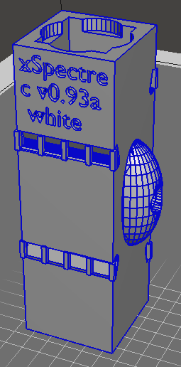
</a>
<a href="https://github.com/xspectrolum/v093a/blob/main/stl/xspectrolum_sample_cuvette-oppos-5mm-white-l_v093a_20240520.stl">
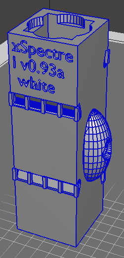
</a>
<figcaption> 3D model of the xSpectrolum cuvette holder for broad band ("white") absorbance/transmittance spectroscopy; left: central hole position, right: lower hole position. The cuvette holder fits the muzzle for liquid sampling.</figcaption>
</figure>

<figure class='double'>
<a href="https://github.com/xspectrolum/v093a/blob/main/stl/xspectrolum_sample_cuvette-oppos-5mm-860nm-c_v093a_20240526.stl">
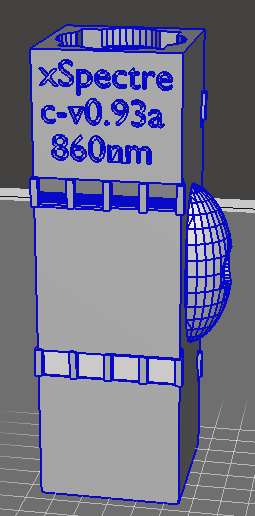
</a>
<a href="https://github.com/xspectrolum/v093a/blob/main/stl/xspectrolum_sample_cuvette-oppos-5mm-860nm-l_v093a_20240526.stl">
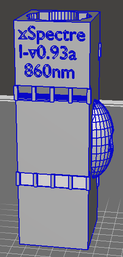
</a>
<figcaption> 3D model of the xSpectrolum cuvette holder for narrow band absorbance/transmittance spectroscopy, example show cuvette holder for 860nm LED; left: central hole position, right: lower hole position. The cuvette holder fits the muzzle for liquid sampling.</figcaption>
</figure>

_Table 2: Available cuvette holders for absorbance/transmittance spectroscopy_

| light beam | lamp form factor | hole position | GithHub stl file |
| :---------------: | :---------------: | :---------------: | :---------------: |
| broad VIS | 5 mm | central | [url](https://github.com/xspectrolum/v093a/blob/main/stl/xspectrolum_sample_cuvette-oppos-5mm-white-c_v093a_20240520.stl) |
| broad VIS | 5 mm | lower | [url](https://github.com/xspectrolum/v093a/blob/main/stl/xspectrolum_sample_cuvette-oppos-5mm-white-l_v093a_20240520.stl) |
| narrow 860nm | 5 mm | cemtral | [url](https://github.com/xspectrolum/v093a/blob/main/stl/xspectrolum_sample_cuvette-oppos-5mm-860nm-c_v093a_20240526.stl) |
| narrow 860nm | 5 mm | lower | [url](https://github.com/xspectrolum/v093a/blob/main/stl/xspectrolum_sample_cuvette-oppos-5mm-860nm-l_v093a_20240526.stl) |
| narrow 950nm | 5 mm | cemtral | [url](https://github.com/xspectrolum/v093a/blob/main/stl/xspectrolum_sample_cuvette-oppos-5mm-950nm-c_v093a_20240520.stl) |
| narrow 950nm | 5 mm | lower | [url](https://github.com/xspectrolum/v093a/blob/main/stl/xspectrolum_sample_cuvette-oppos-5mm-950nm-l_v093a_20240520.stl) |

#### Cuvette holders for fluorescence and Raman spectroscopy

Cuvette holders for fluorescence and Raman spectroscopy have the light beam at a right angle compared to the spectral sensor. The only difference between fluorescence and Raman lamps is the emitted narrow band (excitation) wave-length; Ultra-Violet (UV) for fluorescence and near infrared (NIR) for Raman. Also these holders come in different versions related to the LED form factor (3 or 5 mm) and the position of the spectral sensor. The figure below show examples, all the available holders are listed in table 3.

<figure class="double">
<a href="https://github.com/xspectrolum/v093a/blob/main/stl/xspectrolum_sample_cuvette-side-3mm-385nm-l_v093a_20240520.stl">
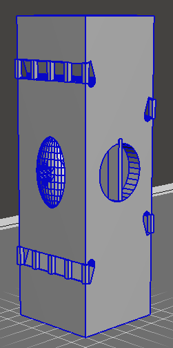
</a>
<a href="https://github.com/xspectrolum/v093a/blob/main/stl/xspectrolum_sample_cuvette-side-3mm-385nm-l_v093a_20240520.stl">
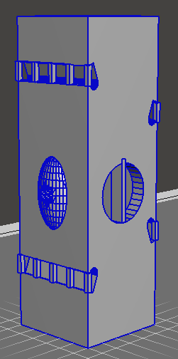
</a>
<figcaption> 3D model of the xSpectrolum cuvette holder for fluorescense and Raman spectroscopy, the example shows the holder for a 3 mm LED; left: central hole position, right: lower hole position. The cuvette holder fits the muzzle for liquid sampling.</figcaption>
</figure>

_Table 3: Available cuvette holders for fluorescence/Raman spectroscopy_

| light beam | lamp form factor | hole position | GithHub stl file |
| :---------------: | :---------------: | :---------------: | :---------------: |
| narrow 385nm | 3 mm | cemtral | [url](https://github.com/xspectrolum/v093a/blob/main/stl/xspectrolum_sample_cuvette-side-3mm-385nm-c_v093a_20240520.stl) |
| narrow 385nm | 3 mm | lower | [url](https://github.com/xspectrolum/v093a/blob/main/stl/xspectrolum_sample_cuvette-side-3mm-385nm-l_v093a_20240520.stl) |
| narrow 390nm | 3 mm | cemtral | [url](https://github.com/xspectrolum/v093a/blob/main/stl/xspectrolum_sample_cuvette-side-3mm-390nm-c_v093a_20240520.stl) |
| narrow 390nm | 3 mm | lower | [url](https://github.com/xspectrolum/v093a/blob/main/stl/xspectrolum_sample_cuvette-side-3mm-390nm-l_v093a_20240520.stl) |
| narrow 395nm | 3 mm | central | [url](https://github.com/xspectrolum/v093a/blob/main/stl/xspectrolum_sample_cuvette-side-3mm-395nm-c_v093a_20240520.stl) |
| narrow 395nm | 3 mm | lower | [url](https://github.com/xspectrolum/v093a/blob/main/stl/xspectrolum_sample_cuvette-side-3mm-395nm-l_v093a_20240520.stl) |
| narrow 400nm | 3 mm | central | [url](https://github.com/xspectrolum/v093a/blob/main/stl/xspectrolum_sample_cuvette-side-3mm-400nm-c_v093a_20240520.stl) |
| narrow 400nm | 3 mm | lower | [url](https://github.com/xspectrolum/v093a/blob/main/stl/xspectrolum_sample_cuvette-side-3mm-400nm-l_v093a_20240520.stl) |
| narrow 405nm | 3 mm | central | [url](https://github.com/xspectrolum/v093a/blob/main/stl/xspectrolum_sample_cuvette-side-3mm-405nm-c_v093a_20240520.stl) |
| narrow 405nm | 3 mm | lower | [url](https://github.com/xspectrolum/v093a/blob/main/stl/xspectrolum_sample_cuvette-side-3mm-405nm-l_v093a_20240520.stl) |
| narrow 405nm | 5 mm | central | [url](https://github.com/xspectrolum/v093a/blob/main/stl/xspectrolum_sample_cuvette-side-5mm-405nm-c_v093a_20240520.stl) |
| narrow 405nm | 5 mm | lower | [url](https://github.com/xspectrolum/v093a/blob/main/stl/xspectrolum_sample_cuvette-side-5mm-405nm-l_v093a_20240520.stl) |
| narrow 860nm | 5 mm | central | [url](https://github.com/xspectrolum/v093a/blob/main/stl/xspectrolum_sample_cuvette-side-5mm-860nm-c_v093a_20240520.stl) |
| narrow 860nm | 5 mm | lower | [url](https://github.com/xspectrolum/v093a/blob/main/stl/xspectrolum_sample_cuvette-side-5mm-860nm-l_v093a_20240520.stl) |

There is also an [illustration version available]((https://github.com/xspectrolum/v093a/blob/main/stl/xspectrolum_sample_cuvette-side-5mm-405nm-c-ill_v093a_20240520.stl)), with dual openings for visual inspection, and not useful for spectroscopic analysis, of the 405nm fluorescence cuvette holder for 5 mm LED.

#### Cuvette muzzle cover

The cover for the cuvette muzzle is attached more firmly and permanent compared to the removable cover for the solid muzzle. The cuvette muzzle cover comes in 2 versions, a higher version with room for opposite light sources and a lower version for side (fluorescence/Raman) light sources.

<figure>
<a href="https://github.com/xspectrolum/v093a/blob/main/stl/xspectrolum_lock_muzzle-cuvette-opposite_v093a_20240512.stl">
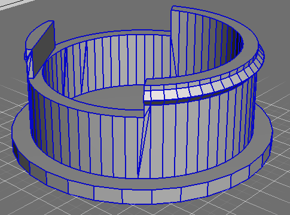
</a>
<a href="https://github.com/xspectrolum/v093a/blob/main/stl/xspectrolum_lock_muzzle-cuvette-side_v093a_20240512.stl">
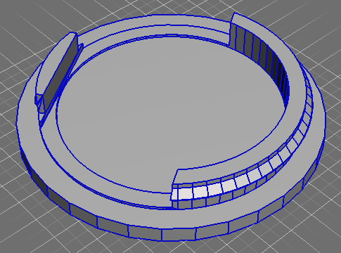
</a>
<figcaption> 3D model of the xSpectrolum cuvette muzzle cover; top: higher version for cuvettes with opposite light sources, bottom: lower version for side light sources.</figcaption>
</figure>

### Mould for silicon casing for the Hamamatsu C14483MA sensor

The Hamamatsu C14483MA sensor must be fitted using a silicon frame or casing. To create the silicon frame a 3D mould can be printed. The mould is tiny (24x48 mm in total) and the image below illustrates how you can place multiple mould models adjacent to each other and print several in one go. This facilitates mixing and casting the silica into the moulds.

<figure class='double'>
<a href="https://github.com/xspectrolum/v093a/blob/main/stl/xspectrolum_casting_c14384ma_v093a_20240608.stl">
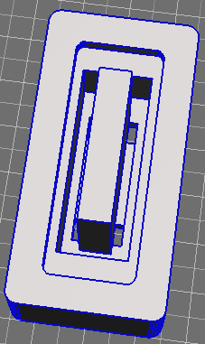
</a>
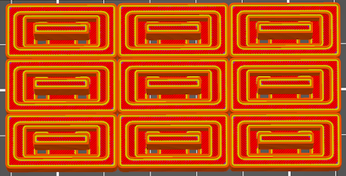
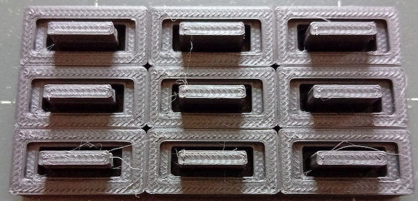

<figcaption> 3D model of the xSpectrolum mould for silicon casing for the Hamamatsu C14483MA sensor; top left: stl model, top right: 9 moulds positioned exactly adjacent to each other for the printing (gcode), bottom: photo of the 9 juxtapositioned moulds.</figcaption>
</figure>

### Muzzle reflector holder

Incandescent lamps for the solid sampler muzzles can be soldered to a special version of the Ledlum PCB for fitting a reflector. The dimensions, both diameter and height, of each lamp must be fitted to a customised reflector folder. These muzzle reflector holders are held in place by the soldering of the lamp to the PCB and by the screw that is used for attaching the PCB to the muzzle. For version v093a, the two lamps being tested are MGG and Eiko - the example below shows the muzzle reflector holder for the MGG lamp.

<figure>
<a href="https://github.com/xspectrolum/v093a/blob/main/stl/xspectrolum_reflector-holder-mgg_v093a_20240527.stl">
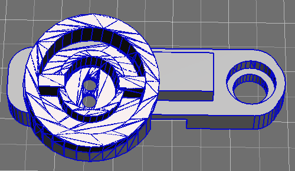
</a>
<figcaption> 3D model of the xSpectrolum muzzle reflector holder for MGG incandescent light bulb. </figcaption>
</figure>

<figure class="double">
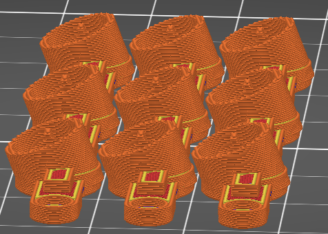
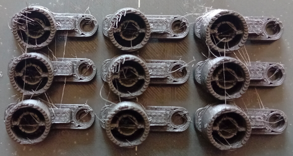
<figcaption> 3D print code (gcode) and printout of xSpectrolum muzzle reflector holder for MGG incandescent light bulb. </figcaption>
</figure>
