### Introduction

This post outlines an idea for how to design and assemble a climate gas monitoring station for the soil-atmosphere interface. As a working name I have called the concept - Caelilum (latin for the light of heaven or just heaven). The first version is intended for monitoring Green House Gas (GHG) exchange from wetlands.

### Idea and design

The overall design is a perforated 2 inch iron pipe with one end having a tip and the other end being open. The pipe is inserted to about one meter in the soil (wetland). The top (10 to 50 cm?) of the perforated pipe should be above ground. Inside the iron pipe a rail fitted with holders for different sensors is inserted. The upper (atmospheric) part is separated from the lower (soil) part by a membrane fitted on the rail. Sensors are fitted both for the atmospheric and the soil sections.

The open top of the pipe is fitted with a 3D printed bayonet coupling that holds the rail and the wires from the sensors fitted on the rail. On top of the pipe, with a corresponding (male-female) bayonet a 3-D printed container (approximately 20x20x20 cm) is fitted. The container houses a Wireless LoRaWAN logger ([Senscap S2100 LoRaWAN data logger](#)), a sensor connection hub ([SenseCAP S2110 Sensor Builder](#)) and a [rechargeable battery](#) of around 20 Ah. The top of the container has another bayonet connected opening for fitting of a [multi-sensor weather station](#).

Within (and outside) the outlined structure the following sensors are fitted:

+ Inside iron pipe - at bottom:
    - water pressure sensor for ground water level,
+ Inside iron pipe - soil section above ground water table:
    - NDIR sensor for CO2, and
    - temperature and pore space moisture sensors.
+ Inside iron pipe - atmosphere section:
    - NDIR sensor for CO2
    - NDIR sensor for CH4.   
+ Outside iron pipe (at some distance)
    - soil penetrometer for temperature and liquid soil moisture.
+ On top of container:
    - anemometer for wind speed and wind direction.

Additionally, the following sensors could be added:
+ Inside iron pipe - atmosphere section:
    - NDIR sensor of N2O.
+ Outside iron pipe:
    - soil penetrometer for pH and/or NPK, and
    - ISFET sensor for pH.
+ On top of container
    - Weather station with integrated sensors for rainfall, temperature, humidity and wind speed/direction.

### Parts and Components

#### 3D printed parts

The 3D printed parts of the climate gas station include:

- bottom part of the main container,
- top part of the main container,
- bayonet connector to fit on top of iron pipe, and
- iron pipe lower end tip.

For the 6 stations to be produced in a proposed test series, the 3D prints will be produced from weather resistant and sturdy carbon fibre filament. Production costs, excluding detailed design and fitting, for 6 units is estimated to 6000 SEK. The material cost for printing additional units is approximately 200 SEK.

<figure class="half">
  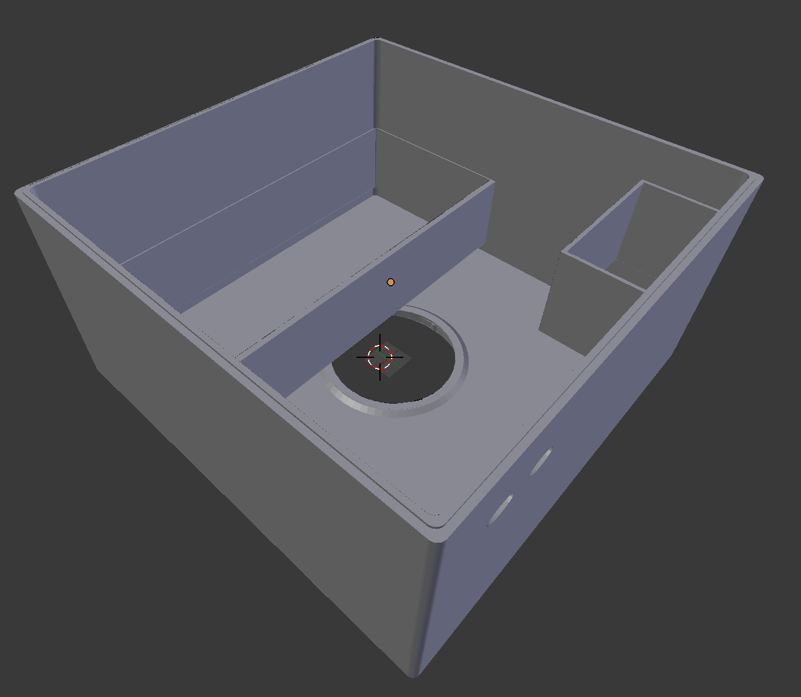

  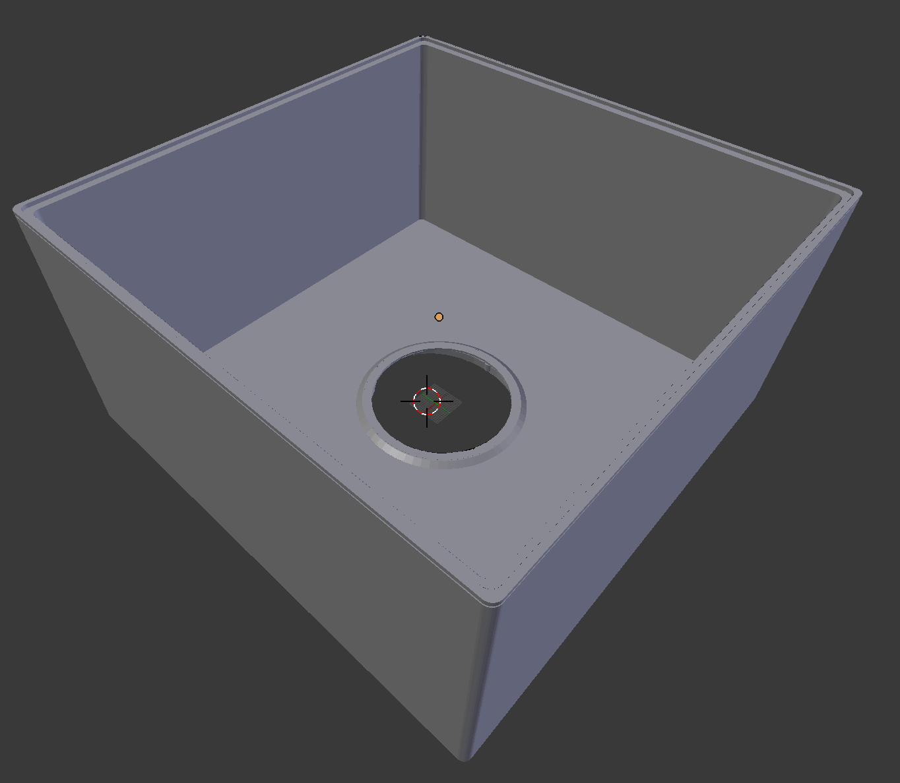

  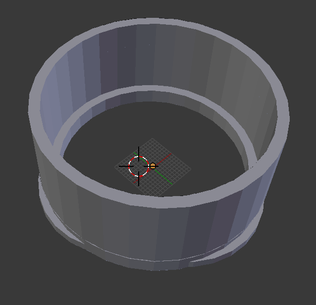

  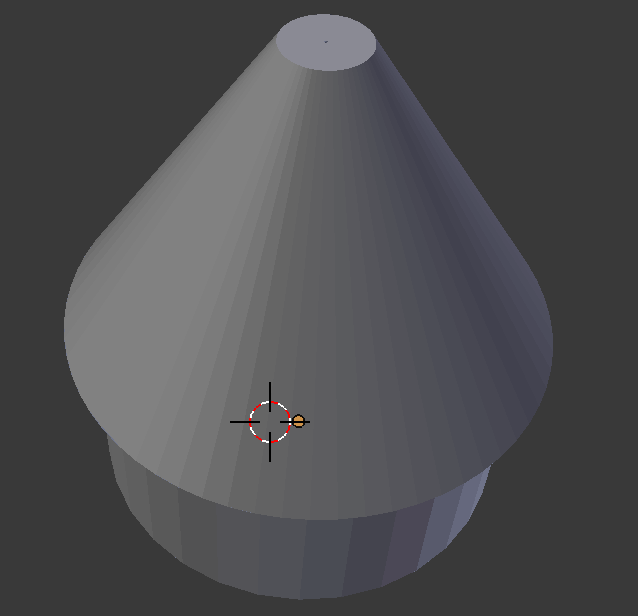

  <figcaption>Sketch versions of 3D parts to be printed;
  top row: upper and lower part of station main container with bayonet openings and holders for battery, sensor hub and logger,
  bottom row: bayonet ring for the steel pipe upper opening and tip for the lower opening. </figcaption>
</figure>

#### Iron pipe

A standard 2 inch iron pipe with ~2 mm perforations is used both for anchoring the station and for housing below ground sensors. The pipe could either be acquired [ready made](https://www.gma.se/produkter/specialprodukter/specialprodukter/copy-of-stand-pipe) or produced in-house from [solid pipes](https://www.biltema.se/bygg/byggbeslag/stalror/stalror-20-mm-2000050441). Maybe perforated [steel pipes for car exhaust pipes](https://www.mrtuning.se/universal/avgassystem-tillbehor/ljuddampare/halror-for-eget-ljuddamparbygge-o50mm-i-svartstal) would be the optimal solution?

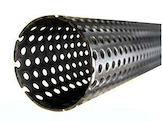
{: .pull-right}

For wetlands perhaps the exhaust pipe alternative would be the most favourable (and cost-effective) pipe. For mineral soils, more sturdy pipes are probably required. The cost for a 1 m perforated steel pipe for exhausts is approximately 300 SEK.

#### SenseCAP S2110 Sensor Builder

The [SenseCAP S2110 Sensor Builder](https://www.seeedstudio.com/SenseCAP-XIAO-LoRaWAN-Controller-p-5474.html?srsltid=AfmBOoq92z3JwSlTMfnM2WI-qncnhuIorDRdsl1dKM7iSYWvad5LFt5O) is an open-source hub for wire connecting sensors using different protocols and convert the input signals to a uniform output. The output signal is then typically sent to a [Senscap S2100 LoRaWAN data logger](#).

<figure>
  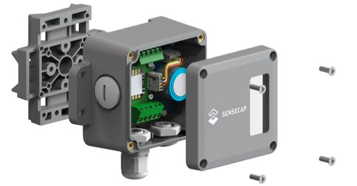

  <figcaption> SenseCAP S2110 Sensor Builder.</figcaption>
</figure>

A SenseCAP S2110 unit costs approximately 200 SEK.

An alternative solution is to use an UART to RS485 converter like the [SparkFun Transceiver Breakout - RS-485](https://www.sparkfun.com/products/10124).

#### SenseCAP S2100 wireless LoRaWAN sensor hub data logger

The [SenseCAP S2100 LoRaWAN logger](https://www.seeedstudio.com/SenseCAP-S2100-LoRaWAN-Data-Logger-p-5361.html) is a weather proof, battery-powered wireless data logger that use LoRa communication for sending data to a [gateway](#). The logger supports RS485/Analog/GPIO sensors. To solve that the input signal for the multiple sensors, the[SenseCAP S2110 Sensor Builder](#) will be used as a hub between the individual sensors and the logger.

<figure>
  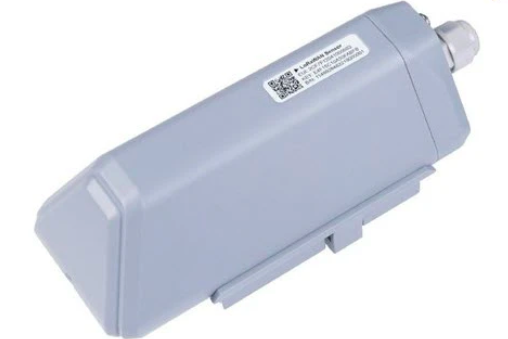

  <figcaption> SenseCAP S2100 LoRaWAN logger.</figcaption>
</figure>

The builtin battery lasts for several years if only used for communication but is too small for operating all the proposed sensors.

The cost for a SenseCAP S2100 LoRaWAN logger is approximately 700 SEK.

#### SenseCap LoRa Gateway

To connect the [SenseCAP S2100 LoRaWAN logger](#) to the internet a LoRa gateway with an internet connection is required. For instance the [SenseCap M1 LoRaWAN Indoor Gateway - EU868](https://www.seeedstudio.com/SenseCAP-M1-LoRaWAN-Indoor-Gateway-EU868-p-5022.html?srsltid=AfmBOoqPAc7okf8mTlkI4TxTgv5gxdLNUSK1oiktvS_P72poggA-_XuE).

The cost for a SenseCap M1 Gateway is approximately 6000 SEK.

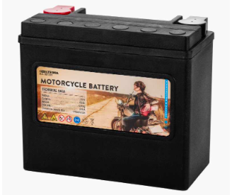
{: .pull-right}
#### 12 V batteri

The power consumption by the sensors required for monitoring climate gases is too high for being long-term supplied by the battery in the [data logger](#).
[A more robust battery, e.g. for motor bikes, with dimensions fitting the proposed container, cost around 1000 SEK](https://www.biltema.se/bil---mc/fordonsbatterier/mc-batterier/agm-batterier/mc-batteri-agm-12-v-20-ah-175-x-87-x-155-mm-2000036062).

#### Water pressure sensor

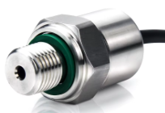
{: .pull-right}
Water pressure sensors operating with microcontrollers most commonly have a simple analog signal response with the voltage returned linearly correlated to the pressure (water depth). The [DFRobot SEN0257](https://wiki.dfrobot.com/Gravity__Water_Pressure_Sensor_SKU__SEN0257)is Arduino compatible (i.e. can be programmed with [SenseCAP S2110](#). It has an accuracy of 0.5 % and cost 200 SEK.

The equivalent [SEEED studio pressure gauge](https://solution.seeedstudio.com/product/industrial-water-level-sensor/) is more expensive but comes with a longer cable if required. It costs around 850 SEK.

#### NDIR CO2 and CH4 sensors

Non-Dispersive Infra-Red (NDIR) sensors have been used for monitoring soil CO2 in several scientific studies as reported by e.g.:

- [Gyawali, Joshi et al. "Talking SMAAC: A new tool to measure soil respiration and microbial activity." Frontiers in Earth Science 7 (2019): 138.](https://www.frontiersin.org/journals/earth-science/articles/10.3389/feart.2019.00138/full)
- [Irving, Daniel, et al. "A cost-effective method for quantifying soil respiration." Soil Security 16 (2024): 100162.](https://www.sciencedirect.com/science/article/pii/S2667006224000364)

There is a range of differently designed and enclosed NDIR CO2 sensors (e.g. offered by [Winsen](https://www.winsen-sensor.com/co2-sensor). Also Seeed studios offers an NDIR CO2 sensor as part of the SenseCap product line - [SenseCAP SOLO CO2 ](https://solution.seeedstudio.com/product/sensecap-solo-co2-5000-ndir-co2-sensor-supporting-modbus-rtu-rs485-and-sdi-12/). It cost around 900 SEK and has an accuracy of +/- 50 ppm.

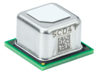
{: .pull-right}
One of the leading developers and producers is [Sensirion](https://sensirion.com) - a company with a Swedish origin. Sensirion [SCD41](https://sensirion.com/products/catalog/SCD41) sensor has an accuracy of +/- 50 ppm and is approximately 10 x 10 x 6 mm. The SCD4x series comes with integrated moisture and temperature sensors. The price for a unit mounted on a breakout board is approximately 500 SEK. A water poof shell that allow free flow of air is required if placed underground.

The upcoming (Q4 2024) [STCC4](https://sensirion.com/products/catalog/STCC4) sensor has a smaller form factor (4 x 3 x 1.2 mm) but a lower accuracy of +/- 100 ppm.

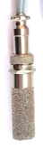
{: .pull-right}
The size of this upcoming sensor, however would allow it to be built together with both a moisture and a temperature sensor and fitted into a water and dust proof (IP44) shell. The PCB of a combined sensor needs to be designed but could be constructed to fit existing water proof (IP44) shells for temperature and moisture sensors. For a demonstration series this is probably the most cost effective alternative for below ground sensing of CO2. Development and production of the required PCB is estimated to around 20 000 SEK. Costs for surface mounted miniature temperature and moisture sensors are negligible in comparison (around 50 SEK for a components with both sensors integrated).

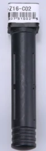
{: .pull-left}
Other NDIR sensors comes with completely different shapes, like the NDIR [MH-Z16 CO2 sensor](https://www.winsen-sensor.com/sensors/co2-sensor/mh-z16.html). The accuracy of various versions is given to between 50 and 200 ppm. One major advantage of the MH-Z16 form factor is that the fitted sensing unit is a standard TO-5/TO-39 container. The quality of a MH-Z16 CO2 sensor is primarily dependent on the sensing unit.

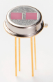
{: .pull-right}
Several producers offer [TO-5 enclosed CO2 sensors, including Hamamatsu](https://www.hamamatsu.com/jp/en/product/optical-sensors/infrared-detector/thermopile-detector/T11722-11.html). It is thus possible to replace, and upgrade, an MH-Z16. Also [CH4 sensors come as dual TO-5 containers](https://www.hamamatsu.com/jp/en/product/optical-sensors/infrared-detector/thermopile-detector/T11722-12.html), and with identical wiring and operation as CO2 sensors, the MH-Z16 shell might be the best way to build a CH4 sensor.

An MH-Z16 CO2 costs approximately 400 SEK. The TO-5 CO2 and CH4 [NDIR (dual filter) sensors from Hamamatsu](https://www.hamamatsu.com/jp/en/product/optical-sensors/infrared-detector/thermopile-detector/T11722-11.html) cost 250 SEK each.

#### NDIR N2O sensor

Also the climate gas N2O can be monitored using NDIR. The principal solution is similar as for NDIR analysis of CO2 and CH4: a dual window thermopile sensors where 1 window is a reference (transparent for the gas to detect) and one is in the wavelength range where the gas is absorbing light. The German company [Micro-Hybrid have a shelf-ready dual window thermopile sensor for N2O (MTS2SENS200)](https://www.microhybrid.com/en/shop/thermal-ir-detectors/mts2sens200-nitrous-oxide/), also available as a [kit with bundled with emitters](https://www.microhybrid.com/en/shop/ndir-bundles/ndir-bundle-n2o/). The Micro-Hybrid NDIR N2O is encapsulated in a TO-39 package with the same dimensions as TO-5, but with different wire lengths (of no consequence for our application).

The N2O offered by Micro-hybrid cost 1000 SEK. The only difference between these sensors and the Hamamatsu CO2 and CH4 sensors is the filter that corresponds to the absorbance wavelengths of the gas to analyse. Alternative producers should be investigated, including Hamamatsu.

There are also other producers that offer ready NDIR N2O sensor, including [Euro-Gas](https://euro-gasman.com/product/nitrous-oxide-n2o-gassense-infrared-n2o-gas-sensor-with-analogue-transmitter/). But these are more specialized and require more effort to fit into the outlined hard-and software solution.

#### Soil penetrometers

Soil penetrometers come in large variety of models, equipped with a range of different sensors. Over the past years steel pinned penetrometers with built-in microcontrollers have become popular. They can can measure temperature, soil moisture, salinity pH and most recently also Nitrogen, Phosphorus and Potassium (NPK). The sensors are sturdy and can be planted permanently direct in the soil. Compared to waterproof enclosed temperature and moisture sensors, the penetrometers are in direct contact with the soil and measure liquid soil moisture content compared to the waterproof enclosed moisture sensors that measure the atmospheric relative humidity.

<figure>

  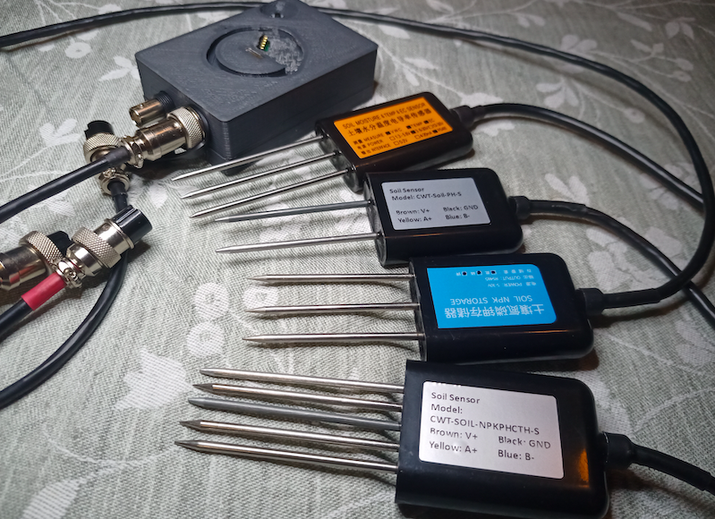

  <figcaption> The kind of steel pinned penetrometers to be used with climate gas monitoring statin come in a variety of types. The frontmost probe can sense all the parameters of the other three combined (blue body: NPK; silver-grey body: pH; orange body: temperature, soil moisture, electric conductivity and salinity).</figcaption>
</figure>

A soil penetrometer for monitoring temperature and soil moisture cost around 200 SEK.

Seeed studies offers a [SenseCap wireless soil moisture and temperature sensor](https://www.seeedstudio.com/SenseCAP-LoRaWAN-Soil-Moisture-and-Temperature-Sensor-LoRaWAN-AU915-p-4977.html) based on the same kind of soil penetrometer. (This is not an alternative for our integrated multi-sensor, but indicates that the proposed solution is tangible.)

#### Weather station

The key weather information to acquire for estimating GHG fluxes across the soil-atmosphere interface is wind speed and wind direction - anemometers.

A new generation of ultrasonic anemometers have reached maturity and are now included as components in many weather station packages, including those developed for integration with microcontrollers. Also [Seeed studios](), the company behind the SenseCap family, has developed weather sensors for integration with their [sensor builder](#) and [logger](). Seed studios offer:
- [traditional SenseCAP S2120 8-in-1 LoRaWAN Weather SensorSenseCap weather station - SenseCAP S2120 8-in-1 LoRaWAN Weather Sensor](https://www.seeedstudio.com/sensecap-s2120-lorawan-8-in-1-weather-sensor-p-5436.html) (@ 2500 SEK),
- [a 7-in-1 compact weather station including ultrasonic anemometer](https://www.seeedstudio.com/SenseCAP-S700-7-in-1-Compact-Weather-Station-p-5651.html) (@ 7000 SEK),
- [ultrasonic anemometer station](https://www.seeedstudio.com/SenseCAP-S200-Wind-Speed-and-Direction-Sensor-p-5693.html?gad_source=1&gbraid=0AAAAACr5AMF0JpEo3GkfMGFSqPp1A3skz&gclid=Cj0KCQjw8--2BhCHARIsAF_w1gwqjk5dxvNnk4sBmIijqXfu1P7z5BBOKs_-Xp0m086skxGyUy4Qm9EaAlcOEALw_wcB) (@ 3000 SEK)

### PMMA test tubes

For testing the Caelilum climate station in a laboratory environment a vessel that can be filled with different soil like materials and then water filled and perhaps injected with climate gases is required. The simplest is probably to make cylindrical container with a diameter slightly larger than the perforated steel pipe and add a bottom and drain valve.

An [acrylic plastic (Poly(methyl methacrylate, PMMA) pipe](https://interglas.se/shop/ror-oe-100-1624p.html) is probably the most easy to use, also because it is transparent. With [PMMA tiles](https://e-plast.se/shop/plastskivor/plexiglas-akryl/plexiglas-klar-500mm-x-750mm-x-3-0mm?gad_source=1&gbraid=0AAAAACUajayJmklIBFEr-lSqxhtGZOSbg&gclid=Cj0KCQjw0Oq2BhCCARIsAA5hubW0QgdXS7qgEidtKS83MumInmqCFRnU32GsG8X73yk8uY7TPiNmb8oaAoKQEALw_wcB) for gluing as bottom on the PMMA pipe. And a [drain valve](https://www.biltema.se/bygg/vvs/sanitet-och-vatten/ventiler-vvs/minikulventiler-vvs/minikulventil-rak-10-x-12-mm-2000061353).

Total material cost for 2 PMMA test tubes amounts to approximately 2000 SEK.

### Proposed components solution

<figcaption>Table 1. Selected components and itemised costs, the cost is either per item or total cost divided by 6 units.</figcaption>

| part | selected component | cost (SEK) [units] |
| :---------- | :---------- | :---------- |
| <b>Hardware</b> |   |   |
| 3D prints | shells etc | 6000 [6] |
| perforated iron pipe | exhaust pipe | 250 [1] |
| <b>ICT</b>  |   |   |
| sensor hub | SenseCAP S2110 | 200 [1] |
| logger | SenseCAP S2100 | 700 [1] |
| gateway | SenseCAP S2100 | 6000 [6] |
| battery | Biltema | 1000 [1] |
| <b>Sensors</b>  |   |   |
| Water pressure sensor | DFRobot SEN0257 | 200 [1] |
| CO2 (belowground)| Sensirion STCC4 | 500 [1] |
| CO2 (aboveground)| Sensirion SCD41 | 500 [1] |
| CH4</sum> (aboveground) | Hamamatsu T11722-12 | 250 [1] |
| N2O | Micro-hybrid N2O bundle | 6000 [5] |
| waterproof casing (belowground) |  ComWinTop CWT-TH03S | 100 [1] |
| PCB for waterproof casing | customised | 20000 [6] |
| shell for CO2, CH4 & N2O)| MH-Z16 | 1000 [1] |
| Penetrometer | ComWinTop TH-S | 200 [1] |
| Weather station | Anemometer SenseCAP S200 | 3000 [1] |
| <b>Other</b> |   |   |
| Test tubes  | PMMA | 2000 [2] |

The total material and production cost for 6 Caelilum evaluation units, including test tubes, amounts to approximately 100000 SEK. The per unit cost for 6 test units thus becomes 17000 SEK. All costs exclude VAT. This cost, however is for a component setup allowing scientific evaluation and includes development costs shared between only 6 instruments.

Removing the costs for the gateway, the PCB development and the laboratory test cylinders reduces the per station cost with 4500 SEK per station. The ultrasonic anemometer can be replaced with a simpler sensor and removed for non-scientific applications. Reducing per station cost with up to 3000 SEK.

Further, in subsequent, larger volume, phases the separate aboveground gas sensors for CO2 CH4 and N2O can be replaced by a single quad-window NDIR sensor with one (1) reference and three (3) absorbance filters (for CO2 CH4 and N2O). This would reduce the per item cost with a further 1000 SEK or more (also reducing the number of shells required).

The per item costs in table are also calculated from low volume (single unit) purchases that would reduce with volume purchases. Component costs in later stages could thus be reduced to between approximately 4000 and 6000 SEK per unit.

### Labour costs

#### Shell, pipe and rail

The material and production costs for the 3D printed parts, the iron pipe and the rail (negligible) are included in Table 1. Labour costs for identification of final components, detailed design, test prints and assembling parts (including the methods and tools for attaching sensors and wires etc) is estimated to 140 hours of work.

#### ICT solution

Development and testing of Information and communication technology (ICT) include: the connection chain from  sensors to the sensor builder hub, further to the logger and then via the gateway to the internet and the development of a server side solution for collecting, storing and retrieving the sensor data. In this first stage there will be no graphical user interface or support for registering users. The development of a basic ICT solution is estimated to 180 hours. For the ICT setup , mainly gateway and server side solution, we need support from an external expert. Half of the estimated 180 hours will go to the external experts.

#### Laboratory testing

To test the principal functions of the Caelilum stations, laboratory tests using soil and water filled PMMA cylinders will be conducted. The test will only include principal functions and no scientific evaluation of measurement accuracies. The laboratory testing work is estimated to 120 hours.

#### Total labour costs

The total labour required for producing and testing 6 Caelilum units is estimated to 440 hours. The hourly rate for external support with ICT (90 hours) is 1200 SEK. For project partners the hourly rate is set at 800 SEK. This brings the total labour cost to 90x12000 + 360x800 SEK, or 396000, excluding VAT.

### Proposal

Monitoring Green House Gas (GHG) fluxes is a prerequisite for developing tangible methods for soil and water management aiming at binding carbon in terrestrial soils and aquatic environments. We have developed a conceptual idea for a climate gas monitoring station for GHG balances in soils and wetlands. The concept takes it starting point in the rapid development of Internet-of-things (IoT) technology and sensors. The design is intended to be useful for both scientific experiments, and, with simpler setup, for monitoring of individual fields, farms and wetlands. The latter with the aim of supporting Monitoring, Reporting and Verification (MRV) for the exploding market of soil carbon credits.

To fulfil scientific requirements, the proposed monitoring station is designed to measure all three climate gases released by soils and wetlands: CO2, CH4 and N2O, and wind speed and direction. In addition also ground water level and soil moisture and temperature conditioned are monitored.

The total development and test cost for 6 stations is estimated to approximately 500 000 SEK. The material cost is estimated to 100 000, external expert support for setting up IoT solutions with server side support to another 100 000, and the remaining 300 000 being partner labour costs. We can contribute 2/3 of the latter costs in-kind and implement the proposed project on a budget of 300 000 SEK.
